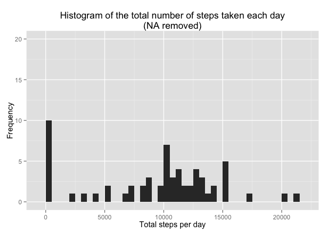
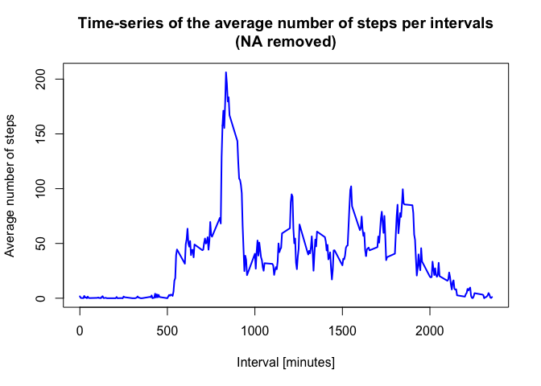
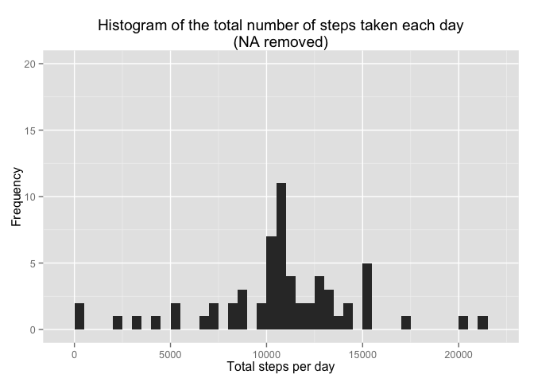

# Reproducible Research: Peer Assessment 1


## Loading and preprocessing the data

###### 1. Load the data (i.e. read.csv())
###### 2. Process/transform the data (if necessary) into a format suitable for your analysis

```r
if(!file.exists('activity.csv')){
    unzip('activity.zip')
}
Activity <- read.csv('activity.csv')
```


## What is mean total number of steps taken per day?

###### 1. Make a histogram of the total number of steps taken each day

```r
stepsByDay <- tapply(Activity$steps, Activity$date, sum, na.rm=TRUE)
qplot(stepsByDay, 
      xlab='Total steps per day', 
      ylab='Frequency',
      ylim=c(0, 20), 
      binwidth=500, 
      main="Histogram of the total number of steps taken each day\n(NA removed)")
```

 

###### 2. Calculate and report the mean and median total number of steps taken per day

```r
stepsByDay_Mean <- mean(stepsByDay)
stepsByDay_Median <- median(stepsByDay)
```
Mean: **9354.2295082**  #
Median: **10395**

-----

## What is the average daily activity pattern?

###### 1. Make a time series plot (i.e. type = "l") of the 5-minute interval (x-axis) and the average number of steps taken, averaged across all days (y-axis)

```r
avgStepsPerTimeBlock <- aggregate(Activity$steps, by=list(Activity$interval), FUN=mean, na.rm=TRUE)
names(avgStepsPerTimeBlock) <- c("interval", "mean")
#head(avgStepsPerTimeBlock)
plot(avgStepsPerTimeBlock$interval, 
     avgStepsPerTimeBlock$mean, 
     type="l", 
     col="blue", 
     lwd=2, 
     xlab="Interval [minutes]", 
     ylab="Average number of steps", 
     main="Time-series of the average number of steps per intervals\n(NA removed)")
```

 

###### 2. Which 5-minute interval, on average across all the days in the dataset, contains the maximum number of steps?

```r
max_pos <- which(avgStepsPerTimeBlock$mean == max(avgStepsPerTimeBlock$mean))
max_interval <- avgStepsPerTimeBlock[max_pos, 1]
```

The 5-minute interval with the most steps is: **835**

----


## Imputing missing values

###### 1. Calculate and report the total number of missing values in the dataset (i.e. the total number of rows with NAs)

```r
numMissingValues <- length(which(is.na(Activity$steps)))
```
Total number of missing values: 2304

###### 2. Devise a strategy for filling in all of the missing values in the dataset.
###### 3. Create a new dataset that is equal to the original dataset but with the missing data filled in.

```r
newActivity <- Activity
newActivity$steps <- impute(Activity$steps, fun=mean)
head(newActivity)
```

```
##     steps       date interval
## 1 37.3826 2012-10-01        0
## 2 37.3826 2012-10-01        5
## 3 37.3826 2012-10-01       10
## 4 37.3826 2012-10-01       15
## 5 37.3826 2012-10-01       20
## 6 37.3826 2012-10-01       25
```

###### 4. Make a histogram of the total number of steps taken each day and Calculate and report the mean and median total number of steps taken per day. 

```r
newStepsByDay <- tapply(newActivity$steps, newActivity$date, sum)
qplot(newStepsByDay, 
      xlab='Total steps per day', 
      ylab='Frequency',
      ylim=c(0, 20), 
      binwidth=500, 
      main="Histogram of the total number of steps taken each day\n(NA removed)")
```

 

```r
newStepsByDay_Mean <- mean(newStepsByDay)
newStepsByDay_Median <- median(newStepsByDay)
```

The newly calculated mean ( **1.0766189\times 10^{4}** ) and median ( **1.0766189\times 10^{4}** ) are greatly different to the estimates from the first part of the assignment. Thus, imputing the missing values brings in more data and directly contributing to a larger mean and median 

----


## Are there differences in activity patterns between weekdays and weekends?

###### 1. Create a new factor variable in the dataset with two levels – “weekday” and “weekend” indicating whether a given date is a weekday or weekend day.


```r
Activity$dayType <-  ifelse(as.POSIXlt(Activity$date)$wday %in% c(0,6), 'weekend', 'weekday')
head(Activity)
```

```
##   steps       date interval dayType
## 1    NA 2012-10-01        0 weekday
## 2    NA 2012-10-01        5 weekday
## 3    NA 2012-10-01       10 weekday
## 4    NA 2012-10-01       15 weekday
## 5    NA 2012-10-01       20 weekday
## 6    NA 2012-10-01       25 weekday
```

###### 2. Make a panel plot containing a time series plot (i.e. type = "l") of the 5-minute interval (x-axis) and the average number of steps taken, averaged across all weekday days or weekend days (y-axis).


```r
Activity_mean_data <- aggregate(Activity$steps, 
                       by=list(Activity$dayType, Activity$interval), mean, na.rm=TRUE)
names(Activity_mean_data) <- c("dayType", "interval", "mean")
#head(Activity_mean_data)
xyplot(mean ~ interval | dayType, Activity_mean_data, 
       type="l", 
       lwd=1, 
       xlab="Interval", 
       ylab="Number of steps", 
       layout=c(1,2))
```

 
